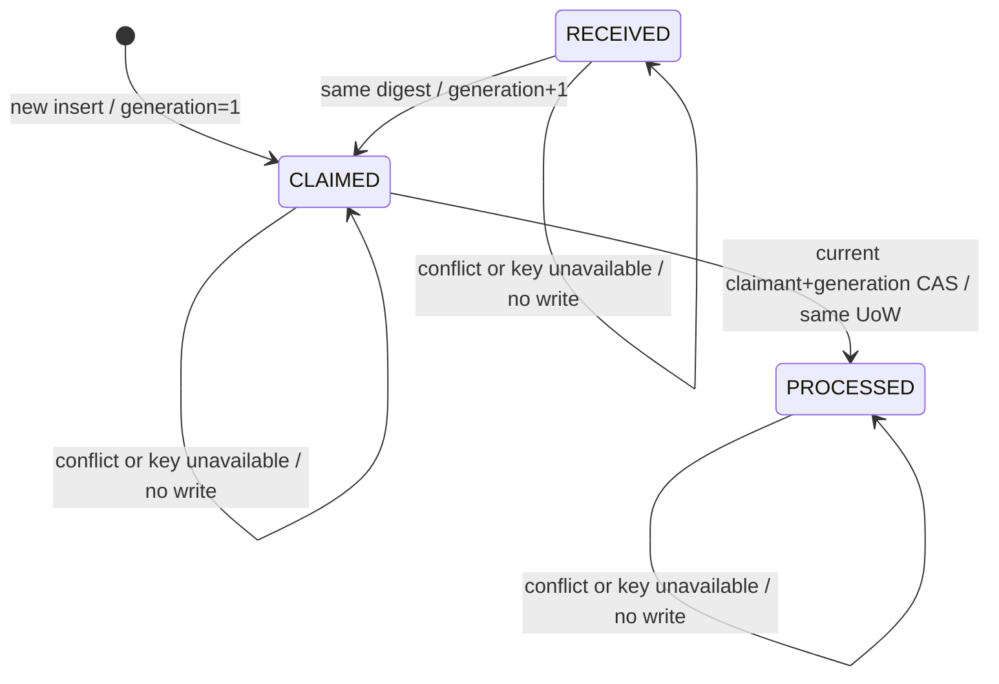

# 并发与事务状态机

[返回索引](00-index.md)

## 状态机

CONFLICT 与 FAILED 是现有 schema 的兼容终态，Task 5 只读不创建。图中的 no-write 路径返回分类，不伪造状态转换。

## 并发序列

### 同 ID、同完整 Update

两个事务同时 INSERT；唯一约束只允许一个插入。输家等待赢家 commit/rollback。赢家 commit 后，输家锁定同一行并返回 duplicate；赢家 rollback 时，等待方的 INSERT 可以成为 claimed。最终最多一行、一个有效 lease。

### 同 ID、异完整 Update

一个事务建立原行；另一事务等待后锁定并以原版本 key 比对，返回 conflict，写入 0。谁先成功插入谁成为原始事实；没有 last-write-wins。

### 同一过期 lease 多方重领

竞争者依次取得 `FOR UPDATE`。第一个在取得行锁后以一条参数化 CTE 的 PostgreSQL 原始精度 `clock_timestamp()` 判断 expiry，并以 inboxId/status/generation/原 claimant CAS 与 `claimed_until <= database_time.value` 成功、generation+1；不把原 expiry 读入 JavaScript Date 后回传相等比较。后续者在各自取得行锁后用新的数据库时间判断活动 lease并返回 duplicate。旧 generation、错误 claimant、错误 inboxId 或数据库时间已到 expiry 的 markProcessed 永远更新 0 行。

## 与 Task 4 的组合

未来业务 orchestrator 必须采用一个外层 `unitOfWork.execute(async context => { ... })`：

1. `claim(context, command)`。
2. 仅 `claimed` 继续执行身份/Outbox 等数据库业务写。
3. 不在 callback 内调用 Telegram、HTTP、OTel exporter 或其他网络。
4. `markProcessed(context, { lease: claim.lease })`。
5. false 时抛 `PublicUnitOfWorkError('APPLICATION_INBOX_CLAIM_LOST')`。
6. callback 成功返回后由 Task 4 pre-commit probe/commit；任何一步失败由 Task 4 rollback。

claim 自己不开事务、不接 root database、不嵌套 UoW、不用 pool/client、不把 context 存入字段。未来外部副作用只能写 Outbox，并与 markProcessed 同事务提交。

## 回滚不变量

- claim、业务写、markProcessed 任一步抛错：同一事务全部回滚。
- callback 在 markProcessed 后抛错：PROCESSED 与业务写均不存在。
- markProcessed CAS false 后调用方抛稳定错误：此前业务写回滚。
- commit outcome UNKNOWN：调用方不得自动重跑业务；先以唯一 Inbox 键查询权威状态并按 Task 4 outcome 处理。
- 数据库连接终止：repository 不吞错、不重试、不换连接；Task 4 负责 rollback/destroy release 与稳定错误。

## Context 生命周期

Task 4 在 callback settle 后、commit 之前 revoke context。repository Promise settle 后保留的 `context.database`、query builder 或 closure 再使用都应抛 `TRANSACTION_CONTEXT_CLOSED`。Task 5 不捕获并重写该安全错误，也不暴露 raw pg/Kysely error。连接 acquire/begin/precommit/commit/rollback/release 分类继续以 Task 4 为准。

## 隔离级别与锁顺序

使用 Task 4 既有事务隔离与一个 Inbox 行锁；本 Task 不执行 `SET TRANSACTION`、advisory lock 或手工 BEGIN/COMMIT。每次 claim 只按一个 `(consumer, external_message_id)` 取锁，不在持锁期间再按不稳定顺序锁多条 Inbox，避免新增死锁图。数据库真正 deadlock/serialization/connection failure 原样进入 Task 4 安全分类，不做内部无限重试。
